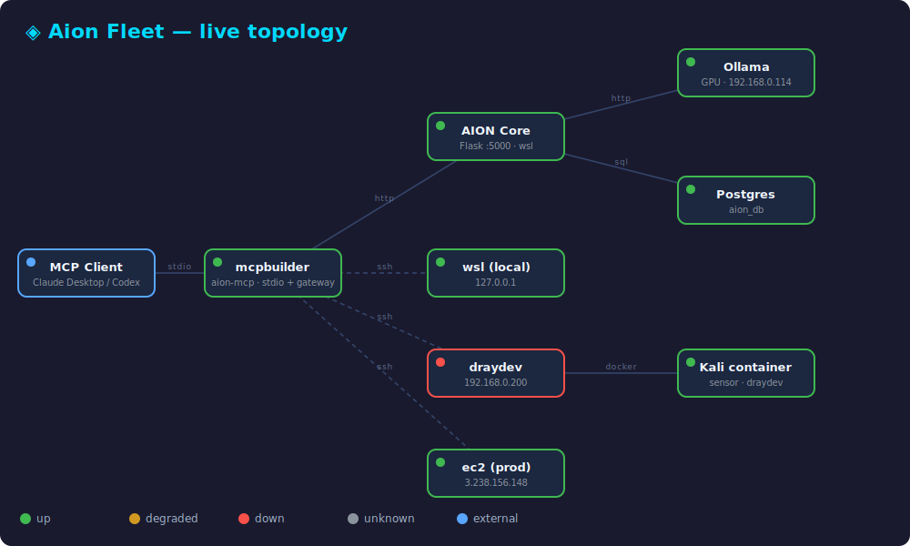

# aion-suite


Clean, self-contained home for the **AION integration used by the `mcpbuilder` MCP server** — extracted from the sprawling drayhub trees so it can be run with one start/stop.

> 🪞 **Highlight:** the suite's own multi-agent `fleet review` (two independent models in
> parallel) caught a real security flaw in *this project's* fleet control hook — an IP-keyed
> confirmation gate vulnerable to NAT hijacking — and both models independently agreed on the
> fix. It's now hardened (username + one-time token). → [HIGHLIGHTS.md](HIGHLIGHTS.md)


## The chain

```
mcpbuilder (aion-mcp, stdio)  ──calls──▶  aion-core (Flask :5000)
                                              │
                        ┌─────────────────────┴─────────────────────┐
                   Ollama (Windows host, GPU)              Postgres (aion_db)
                   aion-producer:latest                    mft-server-db-1 :5432
                   127.0.0.1:11434
```

- **aion-core/** — the Flask API (`web.py`), a clean copy of `drayhub-platform/services/aion`, with a project-local `.venv` and host config in `aion-core/config_local.py`. This is the only service the suite owns.
- **Ollama** & **Postgres** are shared external dependencies — *ensured*, not owned. Ollama runs on the Windows host (GPU); Postgres reuses the existing `mft-server-db-1` container so `aion_db` data is preserved.
- **mcpbuilder** stays at `/mnt/c/projects/mcpbuilder` (its own project). It's stdio, spawned on demand by Claude Desktop / codex — nothing to daemonize. Its aion tools hit `aion-core` at `127.0.0.1:5000`.

## Fleet topology page

AION's chat UI now includes a **Fleet** view (`http://127.0.0.1:5000/fleet`, linked from the
chat header) that draws every machine and service in the stack, the connections between them,
and live per-node health. Click any node for details; machines expand to per-agent
(claude / codex / agy) status. It auto-refreshes every 12s.



Machine/agent health comes from a small **read-only fleet gateway** — a localhost HTTP face
(`:5100`) over mcpbuilder's `fleet_status` probe, since mcpbuilder itself is stdio-only. The
gateway exposes health only (never remote execution) and is started/stopped with the suite. If
it's down, the page degrades gracefully and shows machines as *unknown*. Data sources:

- **infra** (Ollama, Postgres, aion-core) — direct HTTP/TCP probes from `aion-core`
- **fleet machines + agents** (wsl / draydev / ec2) — the fleet gateway
- **Kali container** — the existing `/api/kali` sensor health

### Fleet control from chat

AION chat also *drives* the fleet via `fleet …` commands (handled in `fleet_control.py`,
routed to the gateway). Read is immediate; anything that executes on a machine is staged
and needs an explicit `fleet yes`:

```
fleet status                          machine & agent health
fleet run <machine> <agent>: <task>   e.g. fleet run draydev codex: check disk usage
fleet review: <task>                  fan the task to codex + agy
fleet yes <token> | fleet cancel      confirm (with the staged token) or discard
```

Guardrails: staging returns a one-time token bound to that exact action, and the
confirmation is keyed to the **authenticated username** (not client IP, which collides
behind NAT/VPN) — so only the person who staged an action can confirm it, once. Plus a
localhost-only gateway, an on/off flag (`fleet_control_enabled`), and an optional shared
token (`FLEET_GATEWAY_TOKEN`) on gateway writes. Text that merely starts with "fleet" but
isn't a command falls through to normal chat. (This confirmation design was hardened after a
`fleet review` of the hook itself flagged the original IP-keyed version.)

### LLM tuning

`aion-producer` (Mistral 7B) is tuned in `config.py` (`llm_options` + `llm_keep_alive`) to
balance latency and accuracy: `temperature 0.4` for deterministic recall, `num_predict 1024`
to bound worst-case latency, `num_ctx 8192` (model default) so injected memory isn't
truncated, and `keep_alive 30m` to keep the model resident — which removes the ~2.7s
cold-reload spike that otherwise hit the first message after an idle gap (warm responses are
sub-second). The intelligence test suite still passes 16/16 after tuning.

## Usage

```bash
./start.sh      # ensure Ollama+Postgres, start aion-core + fleet-gateway, verify mcpbuilder, print status
./status.sh     # health line per component (incl. fleet-gw)
./stop.sh       # stop aion-core + fleet-gateway (leaves Ollama+Postgres up)
./stop.sh --deps  # also stop the Postgres container (Ollama untouched)
```

## Config

Everything host-specific is in `aion-core/config_local.py` (git-ignored):
`model=aion-producer:latest`, `OLLAMA_BASE_URL=http://127.0.0.1:11434`,
`DATABASE_URL=…@127.0.0.1:5432/aion_db`, `aion_host=192.168.0.114`.

## Manifest

`aion-suite.json` is the machine-readable source of truth (ids, paths, health checks, deps).

## Notes / deferred

Scope is deliberately minimal (the mcpbuilder AION integration only). Not included: drayhub portal / sonchat / share / sensors. The old drayhub AION trees are left intact — this suite is a clean parallel copy, not a move. A dedicated Postgres (instead of reusing `mft-server-db-1`) is a possible future step.
