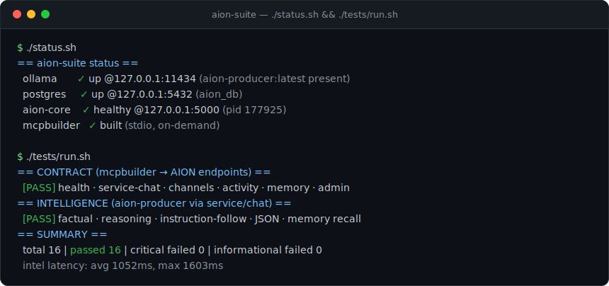

# aion-suite


Clean, self-contained home for the **AION integration used by the `mcpbuilder` MCP server** — extracted from the sprawling drayhub trees so it can be run with one start/stop.



## The chain

```
mcpbuilder (aion-mcp, stdio)  ──calls──▶  aion-core (Flask :5000)
                                              │
                        ┌─────────────────────┴─────────────────────┐
                   Ollama (Windows host, GPU)              Postgres (aion_db)
                   aion-producer:latest                    mft-server-db-1 :5432
                   127.0.0.1:11434
```

- **aion-core/** — the Flask API (`web.py`), a clean copy of `drayhub-platform/services/aion`, with a project-local `.venv` and host config in `aion-core/config_local.py`. This is the only service the suite owns.
- **Ollama** & **Postgres** are shared external dependencies — *ensured*, not owned. Ollama runs on the Windows host (GPU); Postgres reuses the existing `mft-server-db-1` container so `aion_db` data is preserved.
- **mcpbuilder** stays at `/mnt/c/projects/mcpbuilder` (its own project). It's stdio, spawned on demand by Claude Desktop / codex — nothing to daemonize. Its aion tools hit `aion-core` at `127.0.0.1:5000`.

## Usage

```bash
./start.sh      # ensure Ollama+Postgres, start aion-core, verify mcpbuilder, then print status
./status.sh     # health line per component
./stop.sh       # stop aion-core (leaves Ollama+Postgres up)
./stop.sh --deps  # also stop the Postgres container (Ollama untouched)
```

## Config

Everything host-specific is in `aion-core/config_local.py` (git-ignored):
`model=aion-producer:latest`, `OLLAMA_BASE_URL=http://127.0.0.1:11434`,
`DATABASE_URL=…@127.0.0.1:5432/aion_db`, `aion_host=192.168.0.114`.

## Manifest

`aion-suite.json` is the machine-readable source of truth (ids, paths, health checks, deps).

## Notes / deferred

Scope is deliberately minimal (the mcpbuilder AION integration only). Not included: drayhub portal / sonchat / share / sensors. The old drayhub AION trees are left intact — this suite is a clean parallel copy, not a move. A dedicated Postgres (instead of reusing `mft-server-db-1`) is a possible future step.
